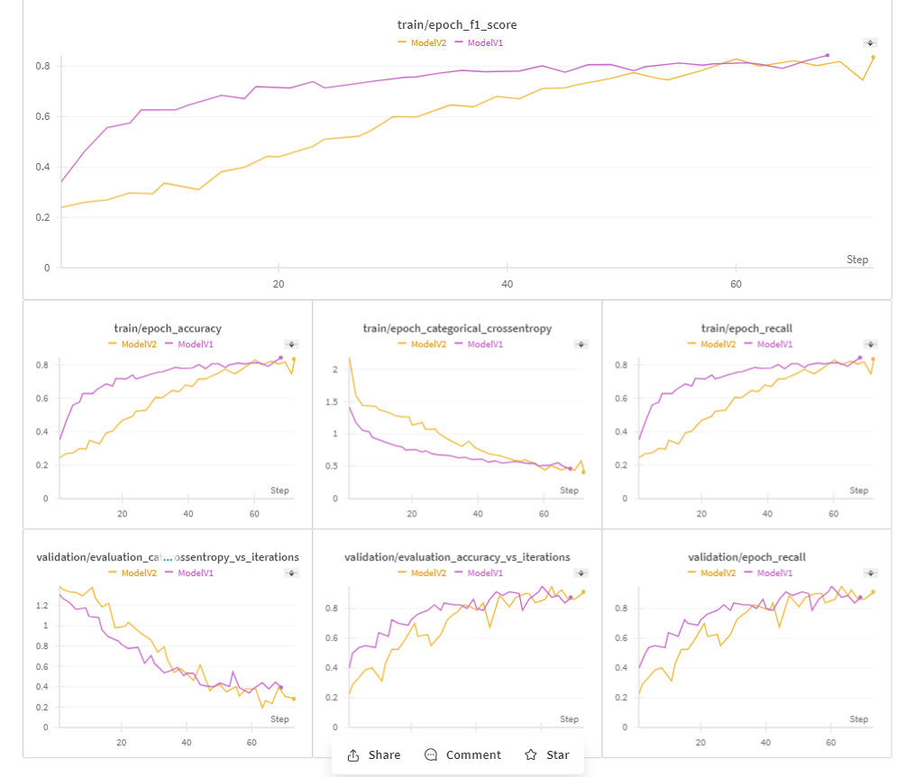
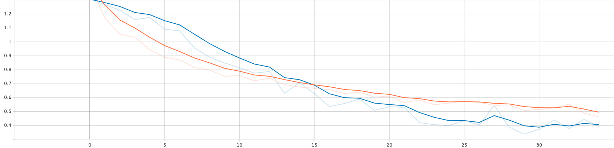

# Product-Categorization

## Project structure

```bash
.
├── data
│   ├── processed
│   │   └── v1
│   ├── raw
│   │   └── v1
│   ├── scripts
│   │   ├── extract.py
│   │   ├── transform.py
│   │   └── load.py
│   └── main.py
├── deploy
│   ├── scripts
│   └── tests
├── develop
│   ├── artifacts
│   ├── eda
│   ├── notebooks
│   ├── scripts
│   │   ├── eda.py
│   │   └── load.py
│   └── main.py
├── label
├── train
├── visualise
├── .flake8
├── .gitattributes
├── .gitignore
├── .pre-commit-config.yaml
├── Makefile
├── poetry.toml
├── pyproject.toml
└── README.md
```
## Task Approachs
### Collecting data
- Initially, I attempted to gather data directly from the application by identifying the endpoints that the application communicates with on the backend. However, this approach proved to be labor-intensive, so I decided to skip it.
- Instead, I obtained data relevant to the task from Kaggle. You can access the dataset [here](https://www.kaggle.com/datasets/lokeshparab/amazon-products-dataset). It comprises approximately 140 CSV files, each containing valuable attributes such as `main_category` and `image` of the product, which will be instrumental for our task.
- Finally, ingest the data in the created instance on `GCP` into `/data/raw` directory
### Data Preprocessing and Preparation
- **Extract only the desired attribute from all 140 CSV files which was `main_category`, `sub_category` and `image_url` and save the output of this phase into `/data/processed/v1`**

    ```python
        def process_all_csv(
            source: str, file_names: List[str], cols: str,destination_base: str
        ):
    ```
- **Combine output of the previous step into single file with about 400k entries**
- **Remove duplicated url after merging**
- **As an intermediate step to handle large dataset and process it i have decide to implement a function to divide any given list into chunks and process from asynchronously in the following steps**
    ```python
    def chunk_list(lst, chunk_size):
        for i in range(0, len(lst), chunk_size):
            yield lst[i : i + chunk_size]
    ```
- **Reduce Labels**
    there was about more that 14 category, i've reduce them into 7 category
- **Implement Async Function to validate the url of each Image**
    ```python
    @classmethod
    async def is_valid_url(cls, url: str, session: aiohttp.ClientSession) -> bool:
        try:
            async with session.get(url) as response:
                response.raise_for_status()
                return True
        except ClientResponseError:
            return False
    ```
    this step helps to reduce the number of entries from **400k** to **200K**
- **Then fetching image of each entry and persist it into the instance that have been created in the Cloud**
    1. Divide the large list into chuncks
    2. Process each chunk asynchronously to get the images from the remote server
        ```python
        async def get_image_from_links(cls, urls: List[str]) -> List[bytes]:
            async with aiohttp.ClientSession() as session:
                tasks = [ImageCollector.fetch_image(url, session) for url in urls]
                return await asyncio.gather(*tasks)

        @classmethod
        async def fetch_image(cls, url: str, session: aiohttp.ClientSession) -> bytes:
            try:
                async with session.get(url) as response:
                    response.raise_for_status()
                    return await response.read()
            except ClientResponseError:
                return None

        ```
    3. persist the collected images into the disk
        ```python
        def persist_images(images: List[bytes], dirs: List[str]) -> bool:
        for image, dir in zip(images, dirs):
            img = parse_image_content(image)
            result = save_cvimage(img, dir)
            if not result:
                print(f"Faild To Persist {os.path.basename(dir)}")

        ```
        - parse the binary data that have been collect to 3d numpy arrays using `OpenCV`
        - save the parsed image into the disk

- **Push the data to kaggle**
    ```bash
        # that create json file for configuring datasets
        kaggle datasets init -p /path/to/data
        # create the dataset after set the metadata
        # using -u argument to be public
        kaggle datasets create --dir-mode tar -p /path/to/data -u
    ```
- **Finally output**

    [here](https://www.kaggle.com/datasets/ahmedelsayedrashad/amazon-products-image) you can access the public dataset on kaggle that resulting from the previous steps

### Modelling Phase
I have decided to use `Tensorflow` rather than `Pytorch` duo to time constraints and our use case that will include:
1. **Transfer Learning**: Utilize pre-trained models available in TensorFlow Hub or models trained on large datasets like ImageNet. Fine-tuning these models for our specific task can significantly reduce training time and data requirements.

2. **TensorFlow Extended (TFX)**: building end-to-end machine learning pipelines for production, consider using TensorFlow Extended (TFX). TFX provides a suite of tools for building, deploying, and maintaining production-ready ML pipelines.

3. **TensorBoard**: TensorFlow comes with TensorBoard, a powerful visualization tool that helps you monitor and debug your models. Utilize TensorBoard for visualizing metrics, model graphs, embeddings, and more to gain insights into your model's behavior.

4. **Model Serving and Deployment**: due to deployment is a significant concern, TensorFlow provides tools like TensorFlow Serving, TensorFlow Lite, and TensorFlow.js for deploying models in various environments, including cloud, mobile, and web.

#### Tensorflow Dataset
Build A Wrapper Class to ingest the images from the saved directory into the model
 1. Process given path of any image and return the label and the image as tensor objects
    ```python
        @classmethod
        def process_path(cls, file_path: pathlib.Path):
            label = ImageProcessor.get_label(file_path)
            img = tf.io.read_file(file_path)
            img = ImageProcessor.decode_img(img)
            return img, label
    ```
2. ImageDataset class is the wrapper class that utilize the previous function to prepare the dataset and provide API to split the dataset into `train`,`validation`,and `test` splits
    ```python
    class ImageDataSet:
        def __init__(
            self, path: str, train_size: float, test_size: float, val_size: float
        ) -> None:
    ```

    ```python
    def get_train_val_test(self, batch_size, width, height) -> Tuple[tf.data.Dataset]:
    ```
    inside the `get_train_val_test` i have utiliz another functions from `ImageProcessor` such as
    ```python
    @classmethod
    def prepare_for_training(cls, ds: tf.data.Dataset, shuffle_buffer_size=1000):

        ds = ds.shuffle(buffer_size=shuffle_buffer_size)
        ds = ds.batch(ImageProcessor.BATCH_SIZE)
        ds = ds.prefetch(buffer_size=ImageProcessor.AUTOTUNE)
        return ds
    ```
    this function take the dataset object and shuffle it then divide it into batches and prefetch it for training efficiency

#### Modelling
I have leverged the power `transfer learning` and used the architecture of **ResNet** with **imageNet** weights
also I have tried another architecture called **VGG19**
with the mentioned weights.
Building 4 different architectures using the previous ones as staring point and tried to adjust them into the our data
here is the initial insights:
- `Model_v1` is perfoming well according to the shown metrics

- Performance of `Model_v2` during training process

- The choosen data have some issues with data labelling so we have to do label correction to enhance the results from this baseline

Tracking all these experiments without using `Tensorboard` and `Weights & Bias` would be trouble indeed :(
